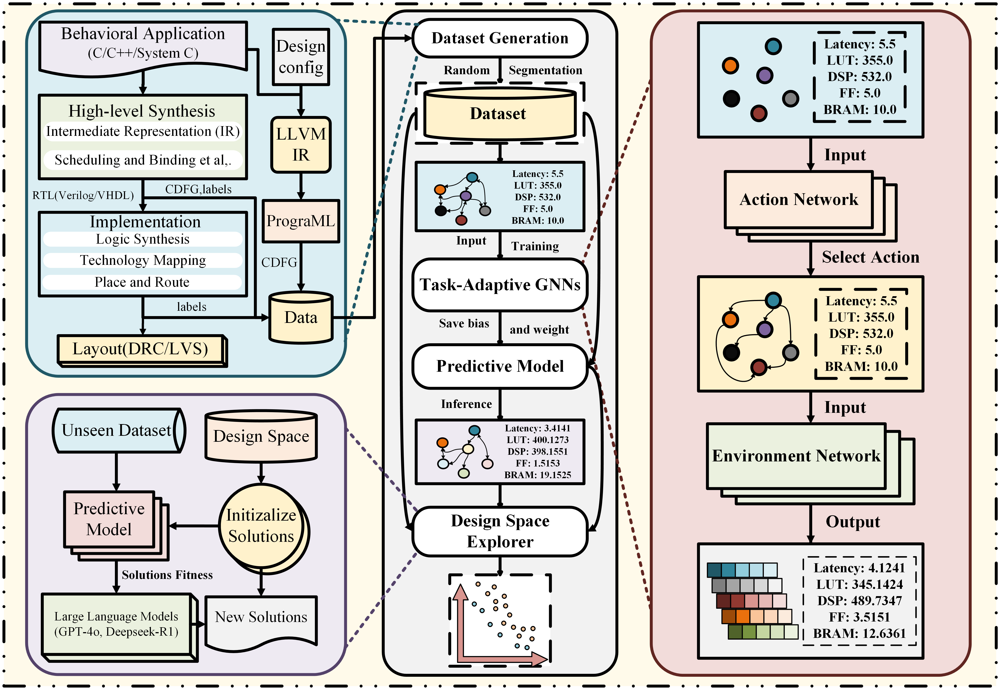

# AI4DSE: Leveraging Graph Neural Networks and Large Language Models for Optimizing High-Level Synthesis Design Space  

## Content
- [About the project](#jump1)
- [Project File Tree](#jump2)
- [Required environment](#jump3)

## <span id="jump1">About the project</span>

This project is an automated framework. By using GNNs as an alternative model to the HLS tool, it predicts the QoR results and utilizes the meta-heuristic algorithms (GA, SA, ACO) assisted by LLMs to identify the Pareto optimal solution with higher quality. The GNNs we use is an improved version based on [CoGNN](https://github.com/benfinkelshtein/CoGNN), which enhances the generalization ability of the model by introducing some modules. Furthermore, the LLMMH framework we proposed is based on the idea of [LMEA](https://github.com/cschen1205/LMEA). 



### Contribution
- Our enhanced CoGNNs architecture achieves simultaneous applicability to both post-HLS and post-implementation QoR prediction tasks, through the integration of global attention mechanisms and gated modules, thereby substantially improving model generalization capacity.
- We enhance LMEA for DSE task compatibility and propose the LLMMH framework, pioneering LLM-driven SA and ACO algorithm implementations. Experimental results demonstrate that all three algorithms in the LLMMH framework surpass conventional metaheuristics in performance, indicating its effectiveness in resolving inherent algorithmic limitations: LLMEA eliminates manual crossover/mutation probability tuning, LLMSA requires no neighborhood distance range specifications, and LLMACO operates without probabilistic parameter configurations. While LMEA employs LLMs for traveling salesman problem (TSP) problem-solving through task instructions, our framework repositions LLMs as meta-heuristic operators that generate superior design configurations through knowledge-augmented synthesis, thereby enhancing Pareto-optimal solution quality. This paradigm shift establishes LLMs as surrogate model-based exploration operators rather than direct optimization solvers.
- We propose the LLMMH framework, which not only enhances conventional metaheuristic algorithms but also aims to pioneer a research direction applying LLMs in DSE. Leveraging LLMs' powerful information comprehension capabilities, we enable them to interpret the functional roles of various pragmas and their impacts on final routing outcomes. While none of the algorithms in LLMMH may currently surpass state-of-the-art (SOTA) DSE methods in performance, this work represents a valuable exploratory effort in integrating LLMs with electronic design automation.

## <span id="jump2">Project File Tree</span>
```
|--CoGNNs_LLMMH
|--baseline                        
|--baseline_dataset    
|   +--CoGNN                       # components of CoGNNs
|   +--action_gumbel_layer.py
|   +--layer.py
|   +--model_parse.py
|--dse_database                    # database, graphs, codes to generate/analyze them
|--LLM_MH                          # the algorithm details of the LLMMH framework and the LLM call code
|   +--dse.py
|   +--LLM.py
|--src                             # the source codes for defining and training the model and running the DSE
|   +--config.py
|   +--config_ds.py
|   +--main.py
|   +--model.py
|   +--nn_att.py
|   +--parallel_run_tool_dse.py
|   +--parameter.py
|   +--programl_data.py
|   +--result.py
|   +--saver.py
|   +--train.py
|   +--utils.py
```

## <span id="jump3">Required environment</span>
- os Linux
- python 3.9.22
- torch 1.12.1+cu118
- torch_geometric 2.2.0
- openai 0.28.1
- numpy 1.23.5
- langchain 0.1.16
